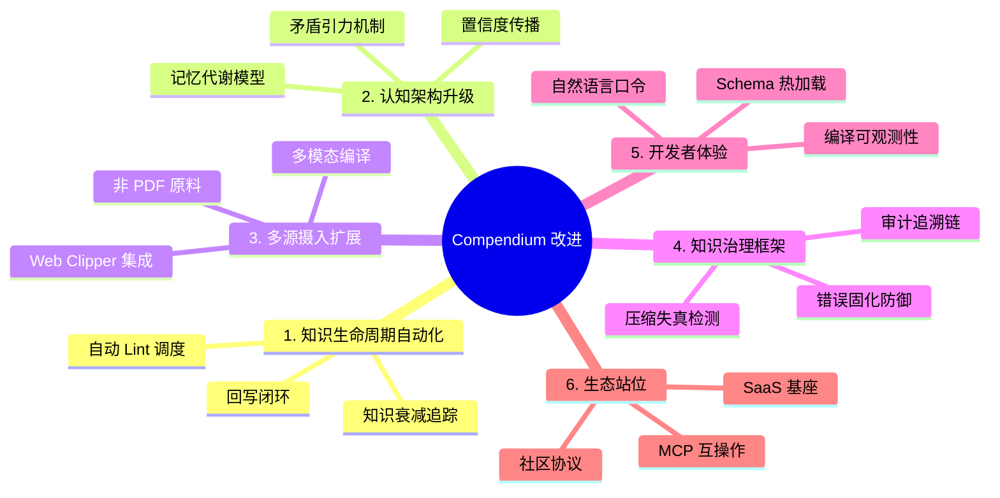
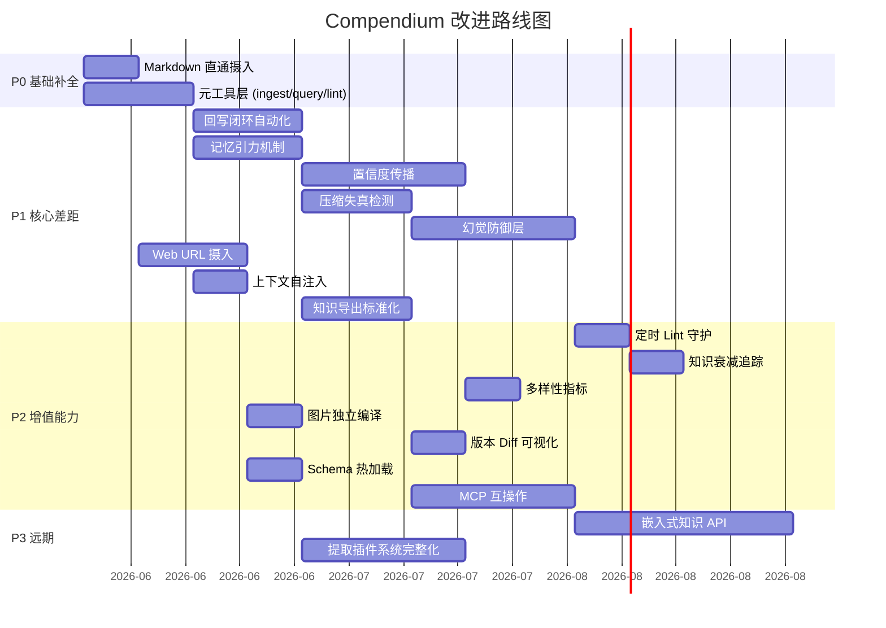

# Compendium 改进方向提案

> **基线**: Compendium v0.5 (Build 149.0.7825) — 53 MCP 工具，Karpathy 编译器模式已实现
> **参考**: Karpathy LLM Wiki 详细说明文档 (2026-04)
> **日期**: 2026-05-21

---

## 〇、定位差距总览

Compendium 已是 Karpathy LLM Wiki 范式最成熟的 **工程化实现**之一，在以下维度领先：

| 维度 | Karpathy 原始蓝图 | Compendium 现状 | 领先程度 |
|------|-------------------|-----------------|----------|
| 编译管道 | 自然语言描述 | 53 MCP 工具 + CompileJob 流水线 | ★★★ |
| 索引能力 | 无（依赖 LLM 直读） | Tantivy + petgraph + TF-IDF 三路融合 | ★★★ |
| 增量编译 | 概念级 | Merkle 哈希 + hash_cache | ★★ |
| 知识金字塔 | L0→Wiki（两层） | L0→L1→L2→L3（四层） | ★★ |
| 质量治理 | Lint 检查 | quality_score + quality_gate + lint_wiki | ★★ |

但与 Karpathy Wiki 文档所描绘的**完整愿景**及学术研究方向对比，仍有 **6 个关键差距**值得弥合。



---

## 一、知识生命周期自动化 — 从「工具箱」到「自运行编译器」

### 1.1 差距分析

Karpathy 原文的核心洞察是 **"消灭簿记成本"** — LLM 应自主完成收集→编译→查询→回写→维护的完整循环。Compendium 目前实现了前半段（收集→编译→查询），但后半段（**回写→维护**）仍依赖用户手动触发。

| 生命周期阶段 | Karpathy 期望 | Compendium 现状 | 差距 |
|-------------|--------------|-----------------|------|
| 收集 (Crawl) | 用户放入 raw/ | ✅ compile_to_wiki | — |
| 编译 (Compile) | LLM 自主编译 | ✅ CompileJob pipeline | — |
| 查询 (Query) | 基于 index.md 导航 | ✅ search_knowledge (hybrid) | — |
| **回写 (Write-back)** | **高价值问答自动保存** | ⚠️ archive_answer 存在但需手动调用 | **中** |
| **维护 (Lint)** | **定期自动扫描** | ⚠️ lint_wiki 存在但需手动触发 | **中** |
| **衰减追踪** | **标记过时声明** | ❌ 无时间衰减机制 | **高** |

### 1.2 改进提案

#### A. 回写闭环自动化 (`auto_writeback`)

```
当前流程:
  用户提问 → search_knowledge → AI 回答 → (结束)

目标流程:
  用户提问 → search_knowledge → AI 回答
    → AI 自评价值 (sampling)
    → 若 score ≥ 阈值 → archive_answer 自动触发
    → 更新 index.md + log.md
```

**实现路径**: 在 `compile_pipeline.rs` 中增加 `AutoWritebackStage`，利用已有的 MCP Sampling 能力让 Agent 评估回答的知识沉淀价值。

#### B. 定时 Lint 守护 (`lint_daemon`)

- 新增 MCP 工具 `enable_periodic_lint`，允许 Agent 设置 Lint 周期（如每 24h）
- 利用 `tokio::time::interval` 在后台定期执行 `lint_wiki()`
- 将 Lint 报告通过 MCP Notification 推送给 Agent

#### C. 知识衰减追踪 (`knowledge_decay`)

- 在 YAML front matter 中增加 `last_validated: DateTime` 字段
- 新增 MCP 工具 `detect_stale_entries`：扫描 `updated` 超过 N 天的条目
- 在 `lint_wiki` 报告中增加 `stale_entries` 分类
- 引入 `decay_score = quality_score × time_decay_factor` 动态质量评估

### 1.3 优先级与影响

| 子项 | 优先级 | 工作量 | 架构影响 |
|------|--------|--------|----------|
| 回写闭环 | P1 | 3d | 需扩展 CompileJob |
| 定时 Lint | P2 | 2d | 需 tokio 后台任务 |
| 衰减追踪 | P2 | 2d | 需修改 entry.rs front matter |

---

## 二、认知架构升级 — 从「编译器」到「伴侣式记忆系统」

### 2.1 差距分析

学术论文 *"Memory as Metabolism"* (Miteski 2026) 将 LLM Wiki 定位为"伴侣式记忆"，提出系统应**主动补偿认知偏差**。Compendium 目前的 `hypothesis_test` 工具提供了矛盾检测能力，但缺少更深层的认知治理。

| 认知能力 | 学术期望 | Compendium 现状 | 差距 |
|----------|---------|-----------------|------|
| 矛盾检测 | 主动发现 | ✅ hypothesis_test | — |
| **思维固化防护** | **避免过度强化单一观点** | ❌ 无多样性指标 | **高** |
| **记忆引力** | **保护承重知识条目** | ❌ 无入度/权重机制 | **高** |
| **置信度传播** | **从源到衍生条目传递** | ⚠️ confidence 字段存在但静态 | **中** |

### 2.2 改进提案

#### A. 认知多样性指标 (`diversity_score`)

- 基于 petgraph 的社区检测（已有 `LouvainCluster`），计算知识库的**观点多样性指数**
- 当某个观点被过度引用（入度 > 阈值）而缺少对立条目时，生成 `diversity_warning`
- 在 `check_quality` 工具输出中新增 `cognitive_diversity` 维度

#### B. 记忆引力机制 (`memory_gravity`)

- 定义"承重条目" = 被 ≥ N 个其他条目引用的核心概念
- 对承重条目施加保护：
  - `recompile_entry` 时强制生成 diff 预览
  - 禁止直接删除，需先解除所有依赖
  - `lint_wiki` 特别检查承重条目的一致性

```rust
// 概念：扩展 GraphIndex
pub struct MemoryGravity {
    /// 被引用次数 → 引力权重
    pub in_degree: usize,
    /// 是否为承重节点
    pub is_load_bearing: bool,
    /// 保护级别: normal | protected | critical
    pub protection_level: ProtectionLevel,
}
```

#### C. 置信度传播 (`confidence_propagation`)

- 当 L0 源材料的 `confidence` 为 `low` 时，所有从该源编译的 L1 条目自动降级
- 当 L1 条目被标记为矛盾时，引用它的 L2 综述条目收到 `needs_review` 状态
- 实现为 petgraph 上的 BFS 传播算法

### 2.3 优先级与影响

| 子项 | 优先级 | 工作量 | 架构影响 |
|------|--------|--------|----------|
| 记忆引力 | P1 | 3d | 扩展 GraphIndex |
| 置信度传播 | P1 | 4d | 修改 entry.rs + graph 传播 |
| 多样性指标 | P2 | 2d | 扩展 quality.rs |

---

## 三、多源摄入扩展 — 从「PDF 专精」到「全格式编译器」

### 3.1 差距分析

Karpathy 原文明确指出 `raw/` 层应接受 **"论文 PDF、网页 Markdown、代码仓库、图片、会议记录"** 等全格式。Compendium 目前以 PDF 为核心（产品名即 "PDF MCP Module"），虽然重命名为 Compendium 暗示了更广泛的野心，但实际能力仍聚焦于 PDF。

| 输入格式 | Karpathy 期望 | Compendium 现状 |
|----------|--------------|-----------------|
| PDF | ✅ 完整管道 | ✅ PdfiumEngine + VLM |
| **网页 Markdown** | **✅ Obsidian Web Clipper** | ⚠️ extrude_to_server_wiki 部分支持 |
| **代码仓库** | **✅ 自然语言蓝图** | ❌ 不支持 |
| **图片/图表** | **✅ VLM 理解** | ⚠️ VLM 仅用于 PDF OCR 回退 |
| **音视频转写** | **未提及但为刚需** | ❌ 不支持 |

### 3.2 改进提案

#### A. 提取插件系统 (`extraction_plugins`)

Compendium 已有 `extraction.plugins.toml` 和 `list_extraction_plugins` 工具的脚手架，但需完成实际实现：

```toml
# extraction.plugins.toml - 目标状态
[[plugins]]
name = "markdown_passthrough"
format = ["md", "markdown"]
handler = "builtin::markdown"

[[plugins]]
name = "web_clipper"
format = ["html", "mhtml"]
handler = "builtin::html_to_markdown"

[[plugins]]
name = "code_repo"
format = ["git"]
handler = "builtin::repo_summary"

[[plugins]]
name = "image_vlm"
format = ["png", "jpg", "jpeg", "webp"]
handler = "vlm::image_understanding"
```

**关键设计**: `ExtractionPlugin` trait 统一所有格式的输出为 `RawExtraction` DTO，后续编译管道无需修改。

#### B. Web Clipper MCP 集成

- 新增 MCP 工具 `ingest_url`：接受 URL → 内部 HTTP fetch → readability 提取 → 存入 raw/
- 可与 Obsidian Web Clipper 的输出格式兼容（YAML front matter + body）
- 利用 `reqwest` + `readability`/`scraper` crate 实现

#### C. 独立图片/图表编译

- 将 VLM 能力从 "PDF OCR fallback" 升级为 "独立图片编译通道"
- 新增 MCP 工具 `compile_image`：图片 → VLM 理解 → 结构化描述 → wiki 条目
- 支持架构图、流程图、白板照片的知识提取

### 3.3 优先级与影响

| 子项 | 优先级 | 工作量 | 架构影响 |
|------|--------|--------|----------|
| Markdown 直通 | P0 | 1d | 最小 |
| Web URL 摄入 | P1 | 3d | 新增 reqwest 依赖 |
| 图片独立编译 | P2 | 2d | 扩展 VLM Pipeline |
| 插件系统完整化 | P2 | 5d | 需 trait 抽象 |

---

## 四、知识治理框架 — 从「质量检查」到「治理闭环」

### 4.1 差距分析

Cochran (2026) 的预注册实验和社区实践揭示了 LLM Wiki 的三大治理挑战：**错误固化、压缩失真、审计断链**。Compendium 有 `quality_score` 和 `check_quality`，但缺少深层治理。

| 治理维度 | 风险 | Compendium 现状 | 差距 |
|----------|------|-----------------|------|
| 错误固化 | LLM 幻觉被编入 Wiki | ⚠️ contradictions 字段 | 缺乏主动验证 |
| 压缩失真 | 重要细节在编译中丢失 | ❌ 无失真检测 | **高** |
| 审计追溯 | 结论无法回溯到原文 | ✅ source 字段 + log.md | 基本满足 |
| **版本对比** | **理解知识演进** | ⚠️ .versions/ 备份但无 diff | **中** |

### 4.2 改进提案

#### A. 压缩失真检测 (`compression_fidelity`)

- 编译完成后，自动计算 L0→L1 的"信息保留率"
- 方法：比较 L0 raw 中的关键实体/数字/定义与 L1 条目中的覆盖率
- 利用已有的 TF-IDF 向量索引计算 cosine similarity
- 若 fidelity < 阈值，在 `quality_issues` 中生成 `compression_loss_warning`

```rust
// knowledge/quality.rs 扩展
pub struct CompressionFidelity {
    pub source_key_terms: Vec<String>,
    pub compiled_key_terms: Vec<String>,
    pub coverage_ratio: f64,      // 0.0 - 1.0
    pub missing_concepts: Vec<String>,
}
```

#### B. 幻觉防御层 (`hallucination_guard`)

- 编译产出的每个事实断言，检查是否在 raw/ 源文件中有对应文本支撑
- 利用 MCP Sampling 让 Agent 自验证："以下陈述是否有原文支撑？"
- 无支撑的断言标记为 `unverified`，禁止传播到 L2

#### C. 知识 Diff 可视化

- 扩展 `preview_wiki_patch` 工具，支持版本间 diff
- 新增 MCP 工具 `compare_versions`：输入条目路径 + 版本号 → 输出 unified diff
- 在 Wiki Browser 前端展示版本演进时间线

### 4.3 优先级与影响

| 子项 | 优先级 | 工作量 | 架构影响 |
|------|--------|--------|----------|
| 压缩失真检测 | P1 | 3d | 扩展 quality.rs |
| 幻觉防御 | P1 | 4d | 需 Sampling 集成 |
| 版本 Diff | P2 | 2d | 扩展 renderer.rs |

---

## 五、开发者体验 — 从「工具矩阵」到「自然语言口令」

### 5.1 差距分析

Karpathy 原文的 Schema 层（`AGENTS.md`）定义了三个简洁口令：`ingest`、`query`、`lint`。Compendium 的 53 个 MCP 工具虽然强大，但对 Agent 而言认知负荷过高。

| 体验维度 | Karpathy 期望 | Compendium 现状 | 差距 |
|----------|--------------|-----------------|------|
| 口令简洁性 | 3 个核心口令 | 53 个工具 | **Agent 选择困难** |
| 编译可观测性 | log.md 审计 | ✅ log.md + CompileJob status | — |
| **Schema 热加载** | **修改后立即生效** | ❌ 编译时嵌入 | **中** |
| **Agent 上下文感知** | **自动理解知识库当前状态** | ⚠️ get_agent_context 存在 | 需强化 |

### 5.2 改进提案

#### A. 元工具层 (`meta_tools`)

在 53 个原子工具之上，新增 3 个元工具作为高层语义入口：

| 元工具 | 映射到 | 行为 |
|--------|--------|------|
| `ingest` | compile_to_wiki → save_wiki_entry → complete_compile_job | 端到端编译，Agent 无需了解内部步骤 |
| `query` | get_agent_context → search_knowledge → get_entry_context | 智能路由：先看索引，再搜全文，最后图谱遍历 |
| `lint` | lint_wiki + check_quality + find_orphans + detect_stale_entries | 一键全面健康检查 |

**实现**: 这些元工具在 `pdf-mcp` 层实现，内部编排原子工具，对外暴露为单一 MCP tool call。

#### B. 编译上下文自注入 (`auto_context`)

当 Agent 首次连接或发出 `ingest` 口令时，自动返回：
- 当前知识库规模（条目数、领域分布）
- 最近 5 条操作日志
- 待处理的质量问题 top 3
- Schema 规范摘要

#### C. Schema 运行时热加载

- 将 `schema/CLAUDE.md` 的加载从编译时 (`rust_embed`) 改为运行时读取
- 用户修改 Schema 后无需重启 MCP 服务器
- 新增 MCP 工具 `reload_schema`

### 5.3 优先级与影响

| 子项 | 优先级 | 工作量 | 架构影响 |
|------|--------|--------|----------|
| 元工具层 | P0 | 3d | 新增 meta_tools 模块 |
| 上下文自注入 | P1 | 2d | 扩展 get_agent_context |
| Schema 热加载 | P2 | 1d | 修改配置加载逻辑 |

---

## 六、生态站位 — 从「个人工具」到「知识层基础设施」

### 6.1 差距分析

Roynard (2026) 提出 Agent 认知架构缺少"持久化语义知识层"，LLM Wiki 可作为该层的实现。Compendium 有潜力成为这个标准化组件，但当前仍定位为独立工具。

| 生态维度 | 目标 | Compendium 现状 | 差距 |
|----------|------|-----------------|------|
| MCP 互操作 | 与其他 MCP Server 协作 | ⚠️ 独立运行 | **高** |
| 多用户协作 | 团队知识共建 | ⚠️ sync_push/pull 脚手架 | **高** |
| 可嵌入性 | 作为其他 Agent 的知识后端 | ⚠️ 仅 stdio MCP | **中** |
| **知识导出** | **标准化知识交换格式** | ❌ 仅 Markdown | **中** |

### 6.2 改进提案

#### A. MCP 互操作协议

- 定义 `knowledge://` 资源协议，允许其他 MCP Server 查询 Compendium 的知识
- 实现 MCP Resource 的 `subscribe` 能力，当知识库更新时通知订阅方
- 示例：一个 "学习助手" MCP Server 可订阅 Compendium 的特定领域更新

#### B. 知识导出标准化

- 新增 MCP 工具 `export_knowledge`，支持多种输出格式：
  - Markdown（当前默认）
  - JSON-LD（语义 Web 标准）
  - Obsidian Vault（含 `[[Wikilinks]]`）
  - OPML（大纲交换格式）

#### C. 嵌入式知识 API

- 将 Compendium 核心能力封装为 `libcompendium` Rust crate
- 其他 Rust 项目可通过 `compendium::KnowledgeEngine` 直接嵌入知识检索
- 对应 Karpathy 的"知识内化"方向 — 虽不到模型微调，但提供 API 级别的知识融合

### 6.3 优先级与影响

| 子项 | 优先级 | 工作量 | 架构影响 |
|------|--------|--------|----------|
| 知识导出 | P1 | 3d | 新增 export 模块 |
| MCP 互操作 | P2 | 5d | 需扩展 MCP Resource |
| 嵌入式 API | P3 | 7d | 重构为 lib + bin |

---

## 综合优先级路线图



---

## 关键决策点

> [!IMPORTANT]
> 以下决策需要你的确认，将显著影响实施方向：

### 决策 1: 产品定位重心

Compendium 的名称已暗示从 "PDF MCP Module" 扩展。是否正式转型为**全格式知识编译器**？

- **选项 B**: 全面转型，PDF 成为插件之一 (工作量大，符合 Karpathy 愿景)

### 决策 2: 认知治理深度

*Memory as Metabolism* 的认知治理（记忆引力、多样性指标）是否为核心差异化？

- **选项 B**: 深度实现认知治理 (学术前沿，独特卖点)

### 决策 3: 元工具 vs 原子工具

53 个原子工具 + 3 个元工具的双层设计，是否满足你的使用体验预期？
- 当前 Agent 使用时，是否频繁出现工具选择错误或调用链过长？

### 决策 4: 多用户协作优先级

`sync_push/pull` 已有脚手架。团队协作场景是否为近期刚需？
- 若是，需优先完善 Git-style 冲突解决 + 补丁提案审核流程
